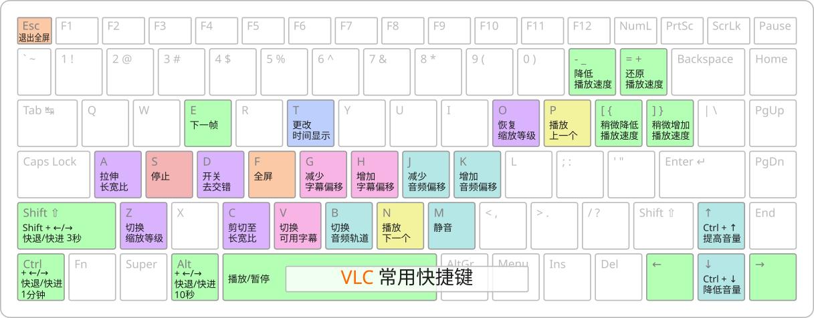

# VLC 媒体播放器


## 概述

VLC 媒体播放器（简称 VLC）是一个可移植、跨平台的媒体播放器。VLC 支持许多解码和编码库，对各种媒体文件的兼容性都很好。

VLC 是[自由软件](https://www.gnu.org/philosophy/free-sw.html)，基于 [GPL-2.0](https://www.gnu.org/licenses/old-licenses/gpl-2.0.html) 发布。

## 安装

VLC 可以由传统包管理器或 [Flatpak](../../concepts/package_managers/flatpak.md), Snap 安装。我们推荐使用 Flatpak 。

[Flatpak](https://flathub.org/apps/org.videolan.VLC) （推荐）
```bash
flatpak install org.videolan.VLC
```

??? info "传统包管理器（apt, yum, pacman...）的安装方法"

    Debian 系：
    ```bash
    sudo apt install vlc
    ```

    RedHat 系：
    ```bash
    sudo yum install vlc
    ```

    Arch 系：
    ```bash
    sudo pacman -S vlc
    ```

## 使用

打开 VLC。

### 播放媒体

点击 **媒体** - **打开文件** ，打开要播放的文件。

### 退出

点击 **媒体** - **退出** 以退出 VLC。

## 快捷键



*原作者： [Todd Weed](https://commons.wikimedia.org/w/index.php?curid=46539645), CC BY-SA 4.0*

*翻译： nopartyfor-sayo, CC BY-SA 4.0*

## 高级

### 使用 FFmpeg 编码/解码库

!!! warning "如果使用 Flatpak 安装..."
    [Flatpak](https://flathub.org/apps/org.videolan.VLC) 版的 VLC 已自带 FFmpeg 编码/解码库，不需要再安装以下软件。

#### Debian 系：

安装 ``ffmpeg`` 包。打开终端，运行
```bash
sudo apt install ffmpeg
```

#### RedHat 系：

安装 ``vlc-plugin-ffmpeg`` 包。打开终端，运行
```bash
sudo yum install vlc-plugin-ffmpeg
```

#### Arch 系：

安装 ``vlc-plugin-ffmpeg`` 包。打开终端，运行
```bash
sudo pacman -S vlc-plugin-ffmpeg
```

## 关于更多...

- [官方网站](https://www.videolan.org/vlc/)： `https://www.videolan.org/vlc/`

- [官方文档](https://wiki.videolan.org/Documentation)： `https://wiki.videolan.org/Documentation`

- [什么是自由软件？](https://www.gnu.org/philosophy/free-sw.html)： `https://www.gnu.org/philosophy/free-sw.html`
