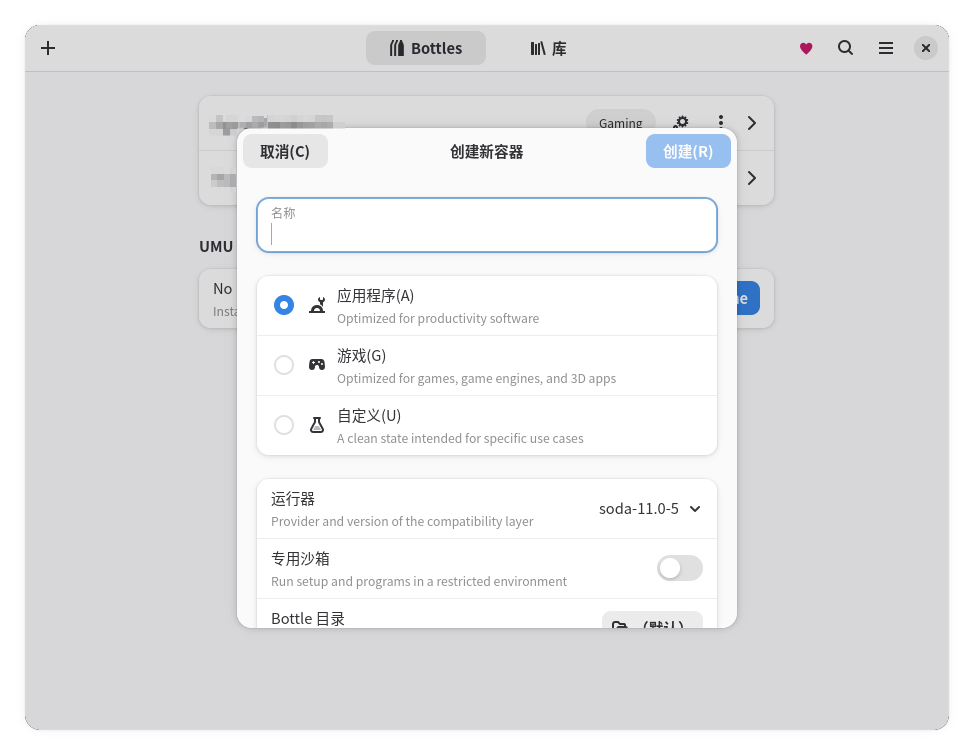
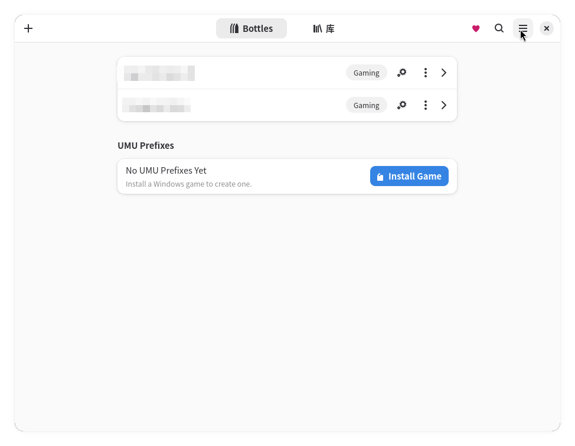
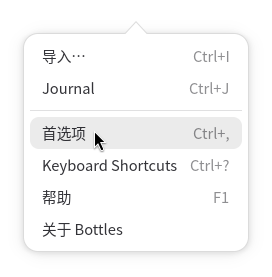
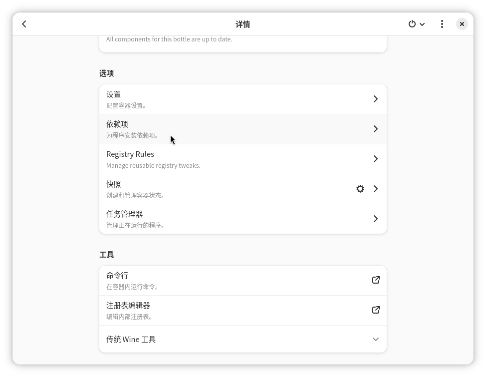
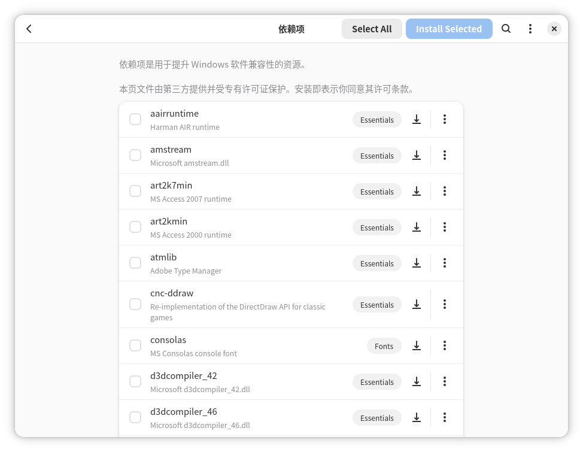
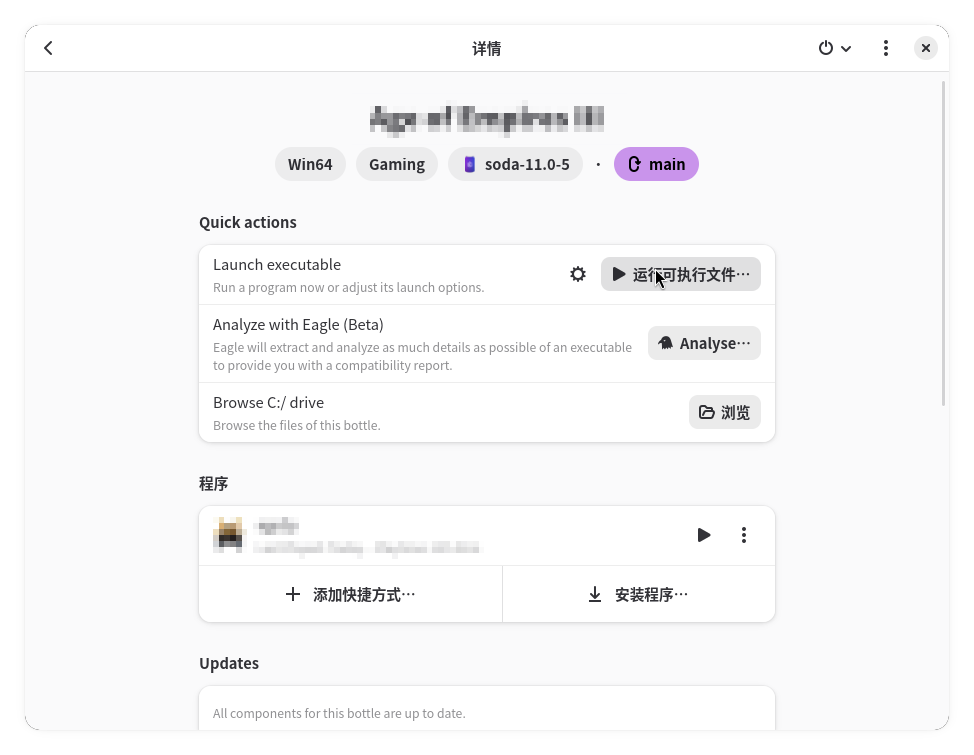

# Bottles

## 概述

Bottles 是一款用图形界面运行 Windows 软件的工具。它将每套 Windows 运行环境（即 Wine 前缀）封装为独立的“瓶子”（Bottle），自动打理兼容层与依赖配置，开箱即用。

与直接使用 [Wine](./wine.md) 相比，Bottles 的优势在于把繁琐的配置封装为图形界面；与 Lutris 不同，Bottles 的理念是“这是我的瓶子，我想在里面装什么软件”，而不是“这个软件需要某个特定版本的 Wine”。Bottles 以 Flatpak 形式官方分发、开箱即用，对新手而言是所有 Wine 前端中门槛最低的选择。

## 安装

Bottles 官方通过 Flatpak 分发应用，这也是经过最完整测试的版本：

```bash
flatpak install flathub com.usebottles.bottles
```

!!! warning "网络问题"
    如果您尚未添加 Flathub 软件源，或在下载时速度缓慢，请参考[应用与工具-Flatpak](../../../applications/apps.md#flatpak)配置 Flathub 镜像。

## 使用

### 首次启动

首次启动时，Bottles 会显示一个引导向导（Onboard），介绍核心概念。随后它会自动下载约 70MB 的必要组件。这是一次性操作，下载的运行器可以用于之后创建的所有 Bottle。

!!! warning "网络问题"
    首次启动的组件下载以及后续的运行器、依赖安装均需要访问 Bottles 的在线仓库（托管于 GitHub），在中国大陆网络环境下可能遇到阻碍。若处于离线状态，Bottles 会暂时禁用所有需要联网的功能，联网后即可继续使用。

### 创建 Bottle

点击左上角的“+”按钮即可创建新的 Bottle。Bottles 提供三种预设环境（Environment），它们是一组预先配置好的依赖与参数：

- **游戏（Gaming）**：默认启用 DXVK、Esync 与独立显卡，预装 d3dx9、d3dcompiler 等组件与基础字体，适合游戏。
- **应用（Application）**：默认启用 DXVK 与 VKD3D，预装基础字体与 Wine Mono（用于替代 .NET Framework），适合办公、绘图、建模等普通 Windows 软件。
- **自定义（Custom）**：完全空白的环境，供您自由实验，创建时可自行选择运行器。



创建后，您可以随时在 Bottle 的设置中修改这些配置。每个 Bottle 相互独立，一个 Bottle 出问题时可以将其删除重建，不影响其他 Bottle；Bottles 也支持导出、导入与克隆 Bottle，方便备份与分享。

### 运行器

运行器（Runner）即 Bottles 使用的兼容层，分为两类：

- **Wine 类**：适用于所有环境。Bottles 提供默认运行器 **Soda**（基于 Valve 的 Wine 分支与 Proton 补丁构建）、补丁更全面的 **Caffe**、来自 Lutris 开发者的构建，以及仅应用 wine-staging 补丁的纯净运行器 **Vaniglia**。
- **Proton**：由 Valve 开发、GloriousEggroll 改进的 GE 版本，是功能更复杂的 Wine 分支，适合较新的游戏。您可以在创建 Bottle 时选择“自定义”环境来选用 Proton，也可以之后随时在 Bottle 设置中切换。

!!! note "关于 Proton 运行器"
    Bottles 官方建议仅在个别游戏确有对应的 Proton 补丁时才使用 Proton 运行器——Valve 也参与了 Wine 的开发，Proton 的许多特性已经合入新版 Wine。



新运行器可以在“首选项-运行器”中点击下载按钮安装；如果愿意尝鲜，也可以开启“预发布（Pre-release）”选项来测试候选版本，代价是可能出现 Bug 或兼容回退。



!!! tip "提示"
    如果您不了解各兼容层之间的差异，保持默认即可。


### 安装软件依赖

Bottles 内置了依赖管理器，可在 Bottle 详情页的“依赖项（Dependencies）”选项卡中一键安装 Windows 软件运行所需的组件，例如 vcredist、dotnet、d3dx9、各类字体等。依赖列表来自[社区维护的在线仓库](https://usebottles.com/database/dependencies)，安装过程完全自动化。

!!! note "提示"
    您可以通过网络搜索或询问 AI，来了解软件需要安装哪些依赖项。





### 安装并运行软件

进入 Bottle 详情页，点击“运行可执行文件（Run Executable…）”，选择您下载的 `.exe` 或 `.msi` 安装程序即可开始安装。

由于 Flatpak 的沙盒机制，Bottles 直接运行沙盒外的程序时可能出现问题。推荐的做法是点击“浏览”，将下载的 `.exe` 或 `.msi` 复制或移动到沙盒内的 C 盘后再运行。

!!! note "提示"
    也可以手动移动。例如，一个名为 `APP` 的 Bottle，其 C 盘所在目录为 `~/.var/app/com.usebottles.bottles/data/bottles/bottles/APP/drive_c`。



安装完成后，Bottles 会自动扫描 Bottle 中的开始菜单快捷方式，将软件列入“程序（Programs）”列表。若列表中没有出现新装的软件（例如软件不写入开始菜单时），可点击“添加快捷方式”按钮手动指定可执行文件路径。之后点击程序右侧的运行按钮即可运行该软件。

???+ note "创建桌面快捷方式"
    在程序的菜单中选择“添加到桌面（Add Desktop Entry）”，即可在系统应用菜单中直接启动该软件。Flatpak 版本的 Bottles 需要额外权限才能生成桌面项，请先关闭 Bottles，然后执行：

    ```bash
    flatpak override com.usebottles.bottles --user --filesystem=xdg-data/applications
    ```

    之后重新启动 Bottles 即可。

## 已知问题

### 中文字体

部分 Windows 软件在 Bottle 中会出现中文显示为“口口口”的问题。您可以在该 Bottle 的“依赖”中搜索并安装 `cjkfonts`（中日韩字体包），或安装 `allfonts` 以覆盖更多字体。

!!! tip "提示"
    如果尝试上述方法后问题仍未解决，也可以向 AI 助手求助。

### 游戏

如果您要运行的是游戏，且该游戏在 Steam 上架，我们更推荐直接使用 [Steam](./steam.md) 运行。Steam 配合 Proton 的兼容性与性能通常优于普通 Wine，且无需任何额外配置。Bottles 更适合运行 Steam 之外的 Windows 软件。

## 相关链接

- [Wine](./wine.md)
- [Steam](./steam.md)
- [Bottles 官网](https://usebottles.com/)
- [Bottles 官方文档（英文）](https://docs.usebottles.com/)
