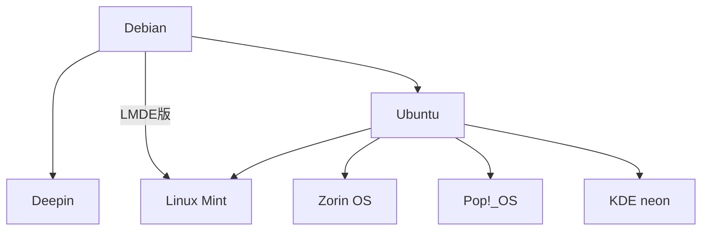

# 介绍页

为了帮助各位理解发行版的关系，我们用下图直观表示。

```mermaid
graph TB
  A ---> C[Deepin];
  A[Debian] --> B[Ubuntu];
  A -->|LMDE版| D[Linux Mint];
  B --> D;
  B --> E[Zorin OS]
  B --> F[Pop!_OS]
  B --> G[KDE neon]
```
[^1]: 大多数基于Ubuntu的发行版会预装Snap，部分（如Linux Mint）除外。
