# Debian
*—— 安装 Debian GNU/Linux 13 (trixie)*

## 简介

**Debian GNU/Linux***（以下简称 ****Debian****）* 以坚如磐石的稳定性、强大的社区支持而闻名。Debian 在 2025 年 8 月发布了名为 *Trixie* 的第 13 个新版本，带来了更新的内核、新版本的桌面环境以及许多其他新软件。

所以，如果您因为 Micro$oft 停止了对 Windows 10 的支持，或 Apple 每隔两三年就停止支持上一个版本的 macOS 而想尝试 Linux，Debian 是一个很不错的选择。

下面是一篇完整的 Debian 安装指南。

## 准备

在开始前，您需要下载 Debian 13 的安装 ISO。上一节中的**“[下载镜像](../before-installing.md#_5)”**中有所叙述。

???+ tip "Debian 的安装镜像下载地址..."
    [Debian 的详细信息](../../distros/debian/debian.md#_2)中有记录。前往***“镜像下载地址”*项**下面的网页，点击 `current/`，再点击电脑的架构（一般是`amd64/`），再点击 `iso-cd/`，选择 `debian-`...`-netinst.

下载镜像后，您需要将镜像烧录到U盘（或移动硬盘）中。可以参考上一节中的**“[烧录镜像](../before-installing.md#_6)”**。

烧录完成后，您需要从烧录完的有安装镜像的U盘（或移动硬盘）中启动。

这篇教程使用 `debian-13.6.0-amd64-netinst.iso` 。

## 安装

从U盘（或移动硬盘）启动后，“Debian安装程序菜单”会出现。这个菜单通常有好几个选项，但为了方便，我们选择第一个选项 `Graphical install`，即 `图形化安装程序` 。

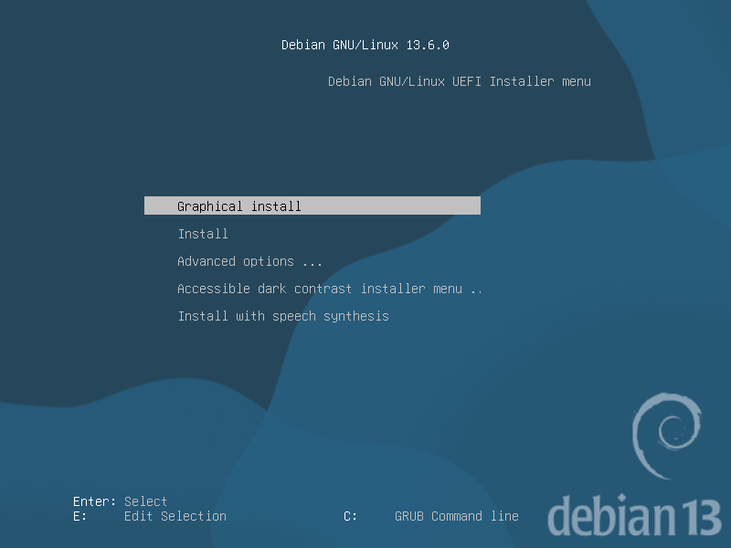

按回车键 `Enter` 来确认。

### 本地化

#### 选择语言

在这一步，选择想要的语言。在这篇教程里我们选择 `中文（简体）`。

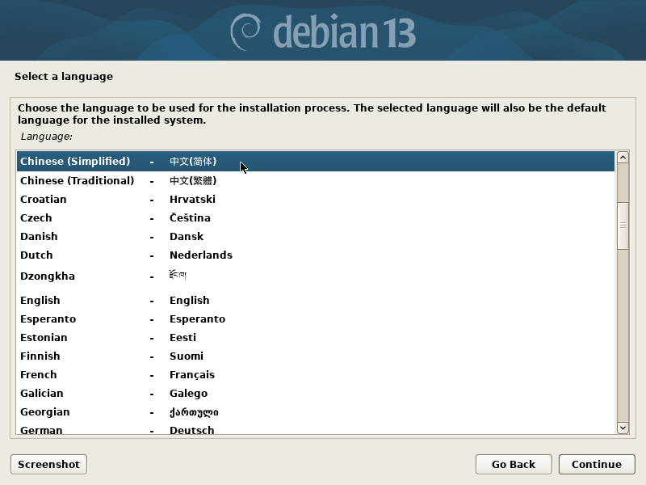

点击下一步 `Continue` 来继续。

#### 选择区域

在这一步，选择想要的区域（您现在所在的区域）。在这篇教程里我们选择 `中国`。

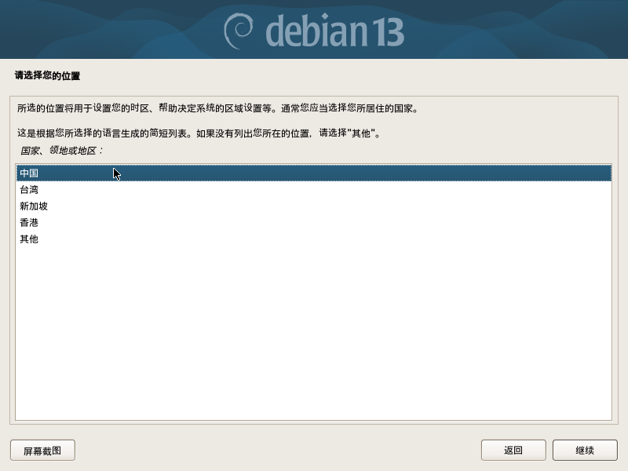

点击 `继续`。

#### 键盘设置

在这一步，选择您的键盘映射。笔者的键盘是标准 104 键 ANSI 布局，所以笔者选择 `美式英语`。如果您的键盘是欧式键盘（105 键 ISO 布局），选择一个欧洲的语言。以此类推...

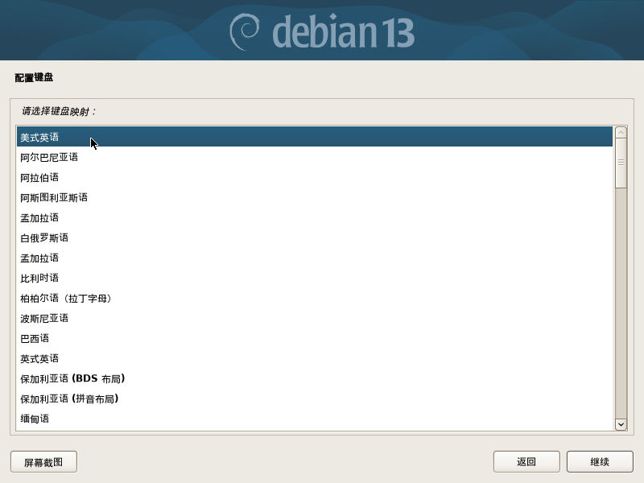

选择完成后，点击 `继续`。

### 网络设置

#### 主机名

在这一步，我们需要输入我们的主机名（hostname）。默认的“`debian`”在大多数情况下都够用，不过您也可以更换为别的名字。这里，笔者选择了 `desktop-pc` 这一主机名。

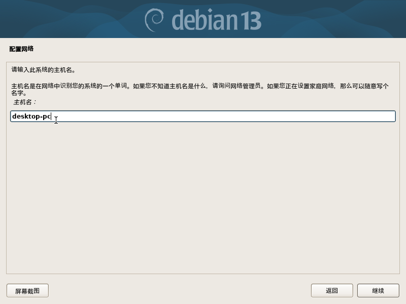

输入完成后，点击 `继续`。

#### 域名

在这一步，我们需要输入域名。如果您跟我一样，不将这台电脑连接到公网，可以随便写一个或者留白。在这里我们选择留白，直接点击 `继续`。

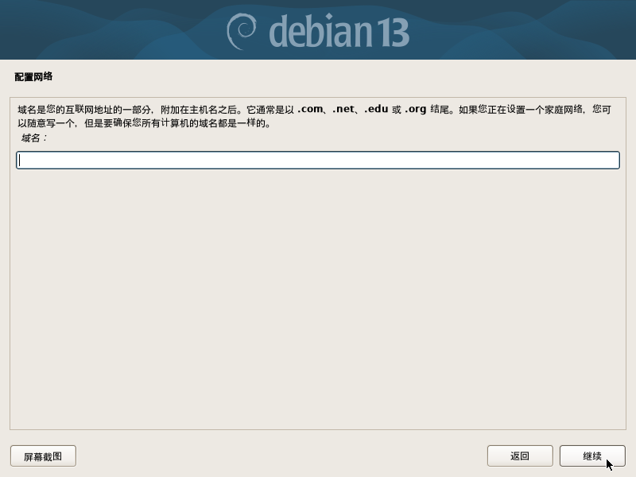

### 用户和密码

#### 超级用户（root）密码

在这一步，我们设置 root 的密码。应该避免使用过于简单的密码。

输入两遍要设置的密码。

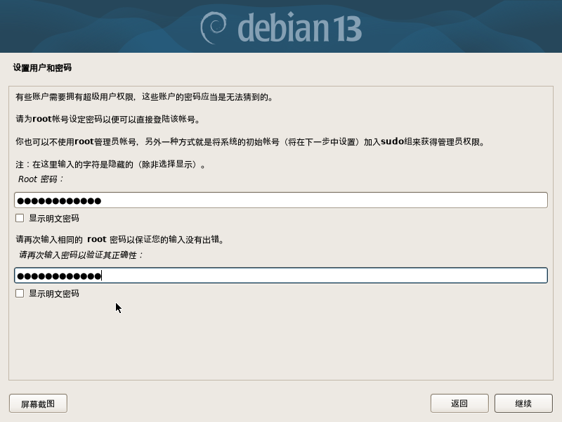

输入完成后，点击 `继续`。

#### 普通用户

在这一步，我们要创建一个“普通”用户。这个用户是我们处理日常任务（游览网页，发邮件，打游戏...）时使用的账号。我们可以用任何想要的名字。

先输入用户的全名。在这里，我是 `Linux Cabin`。

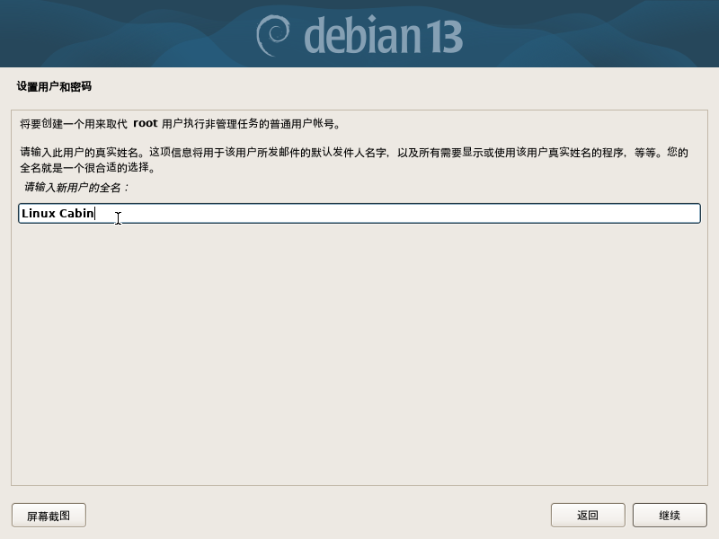

!!! warning "中文全名...？"
    虽然可以，不建议使用中文内容作为全名。

输入完成后，点击 `继续`。

接下来我们要输入这个用户的用户名（username）。

???+ note "为什么全名和用户名不是一个东西"
    我们知道电脑很不适合处理带有空格的字符。（西方）人的全名中带有空格，电脑一碰到它们就会爆炸 —— 如此就有了“用户名”这个概念。

输入想要的用户名。安装器默认会取您全名中的名字。

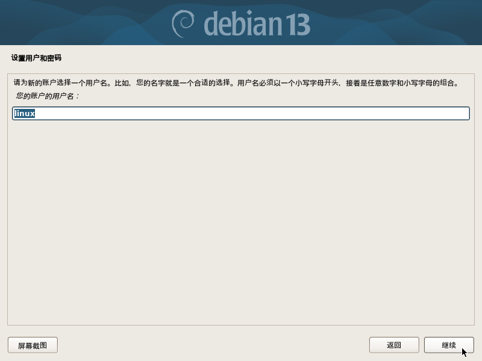

在这里，我们觉得默认的 `linux` 用户名挺好。

!!! warning "中文用户名...?"
    不要使用中文用户名。电脑比空格更不喜欢中文字符。

设置完成后，点击 `继续`。

现在我们要设置普通用户的密码。像上面的 root 密码一样，应该避免使用过于简单的密码。

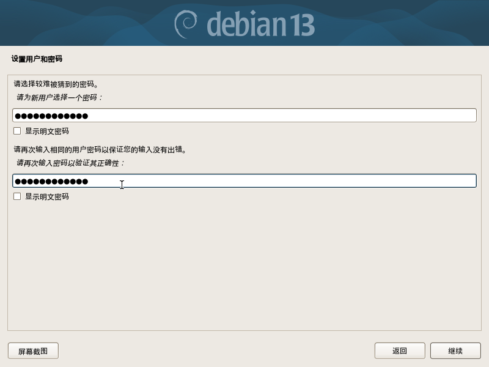

输入完成后，点击 `继续`。

### 分区硬盘

#### 选择合适的向导

创建用户帐户密码后，安装程序会自动设置系统时间和时钟。现在我们需要对硬盘进行分区。如果想打算安装双系统，选择 `向导 - 使用最大的连续空闲空间`。如果想要***删除***所有其他的系统（macOS, Windows...）并将整个硬盘留给 Debian，选择 `向导 - 使用整个磁盘`。

!!! warning "备份好重要数据"
    虽然安装过程已经很安全，**仍然应该考虑备份您的重要数据。**你可以把数据拷贝到其他U盘（或移动硬盘），上传到云盘，等等...

    要现在备份数据，拔出安装媒介（U盘，移动硬盘）并断电重启。备份完成后，从头开始安装过程。

    当然，**如果您想选择的是 `向导 - 使用整个硬盘`，备份所有您需要的数据。**

在这里我们想保留硬盘上的 Windows 系统，所以我们选择 `向导 - 使用最大的连续空闲空间`

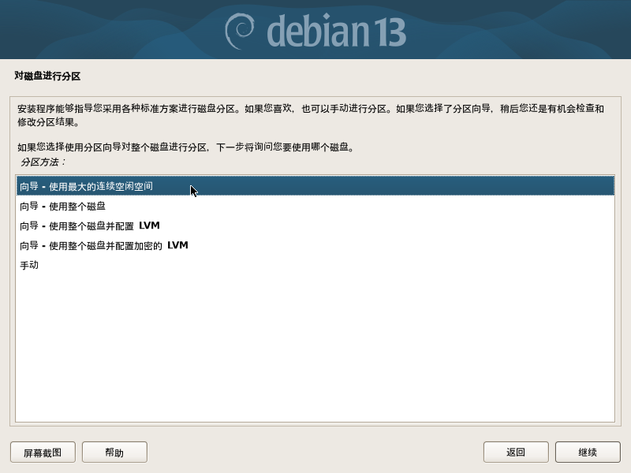

点击 `继续`。

#### 选择分区方案

不同于 Debian 安装器上面写的，笔者建议新手使用 `将 /home 放在单独的分区` 这一方案。该方案下我们的数据储存在一个单独的分区（`/home`），如果一些可怕的事情发生在了根分区上（`/`），我们的数据仍会安然无恙。

这里我们选择 `将 /home 放在单独的分区`

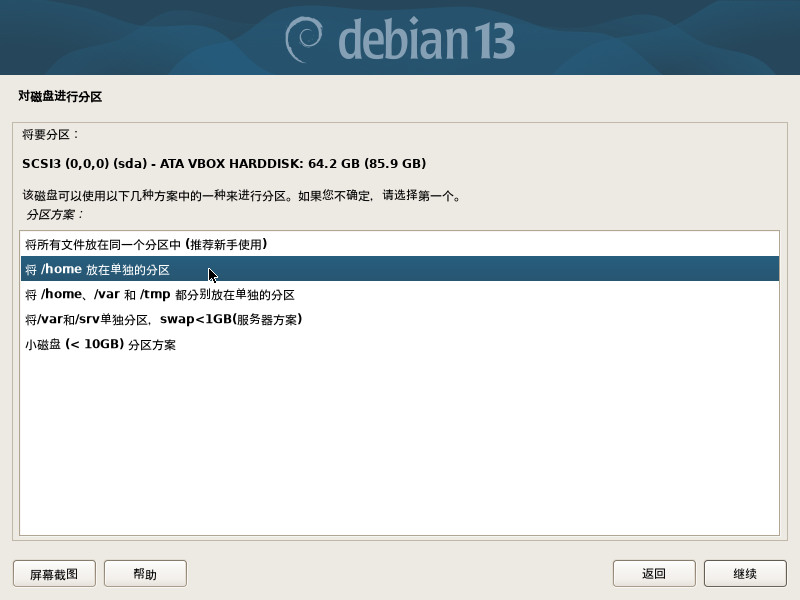

选择完成后，点击 `继续`。

安装器会问我们分区的布局是否正确。

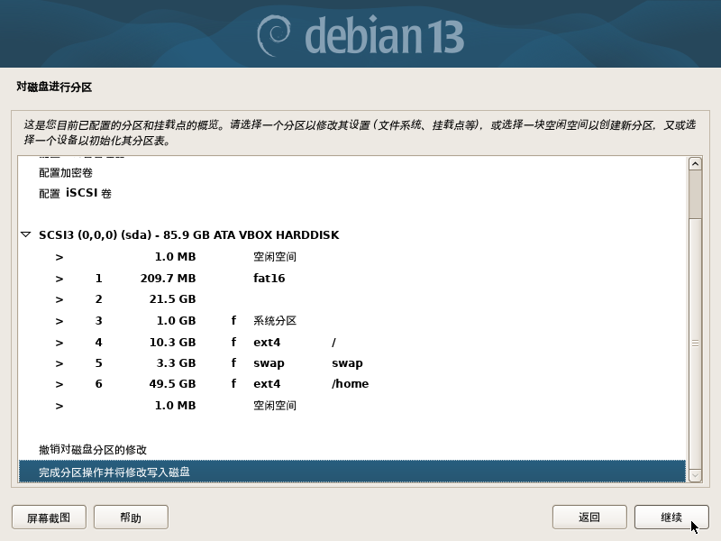

确认没问题后，选择 `完成分区操作并将修改写入磁盘`，点击 `继续`。

#### 写入分区表

安装器会最后问我们一遍要不要把新分区布局写入硬盘。

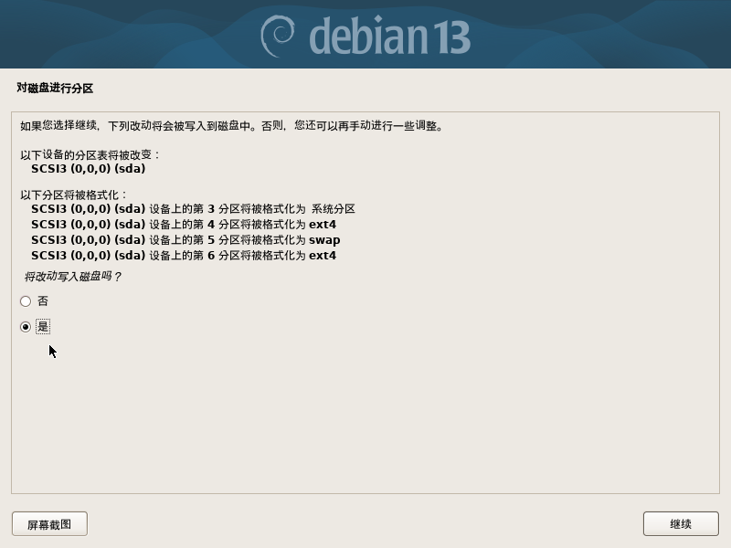

选择 `是`，再点击 `继续`。

### 软件包管理器

#### 扫描更多安装媒介

如果您使用 `NETINST` 或 `DVD` 镜像（一般情况下都是这样），跳过这一步。

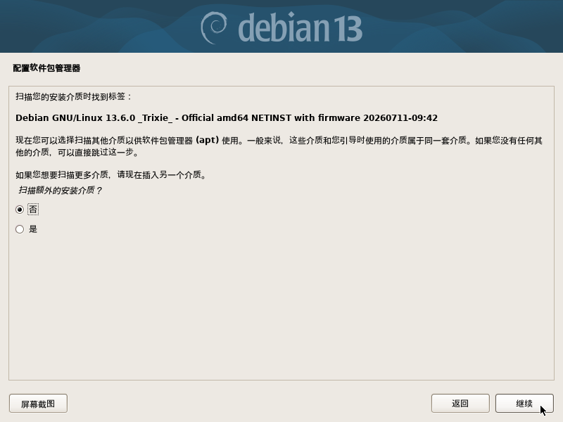

直接点击继续。

#### 选择镜像站

镜像站是 Debian 的包管理器 APT 在安装软件时下载的站点。我们应该选择离自己最近的国家（或地区），通常来说这样最快。

这里我们选择 `中国`。

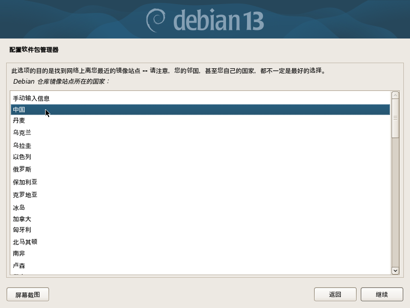

选择好后，点击 `继续`。

安装器会问我们具体选择哪个镜像站。

对于中国内地来说，**除 `deb.debian.org`，`ftp.cn.debian.org`，`debian-archive.trafficmanafer.net` 外**，几乎每一个镜像站都是不错的选择。

在笔者这里 `mirror.nju.edu.cn` 速度最快，所以笔者选择 `mirror.nju.edu.cn`。

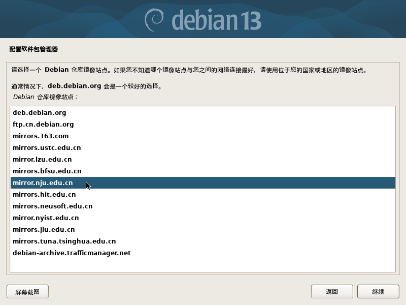

选择完成后，点击 `继续`。

#### HTTP 代理

接下来安装器会问我们 HTTP 代理。一般用户不需要 HTTP 代理，可以直接跳过。

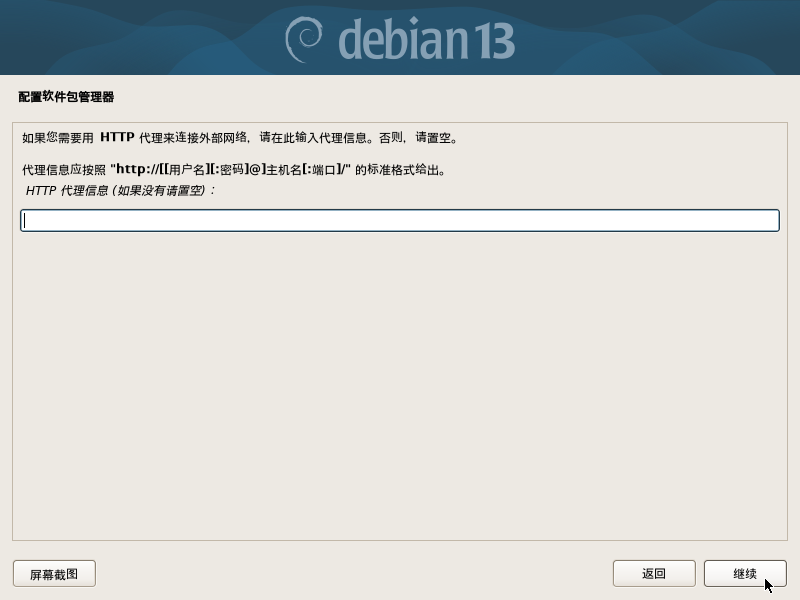

不输入任何内容，直接点击 `继续` 以跳过。

#### 安装必要软件包

软件包管理器配置完成后，安装器将开始更新并安装必须的软件包。此过程可能需要几分钟，具体时间取决于您的网络速度。

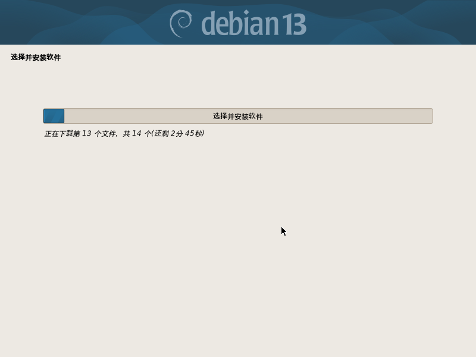

#### 软件包流行度调查

这一步，安装程序会询问您是否愿意参与用户调查。如果参加，程序会收集您系统的一些统计数据并将其发送给 Debian 的开发人员，这将有助于他们改进 Debian 的未来版本。

所有的数据都会被匿名化。

在这里笔者选择“是”，因为笔者想支持这个开源项目。如果您不想分享您的信息，也可以选择“否”。

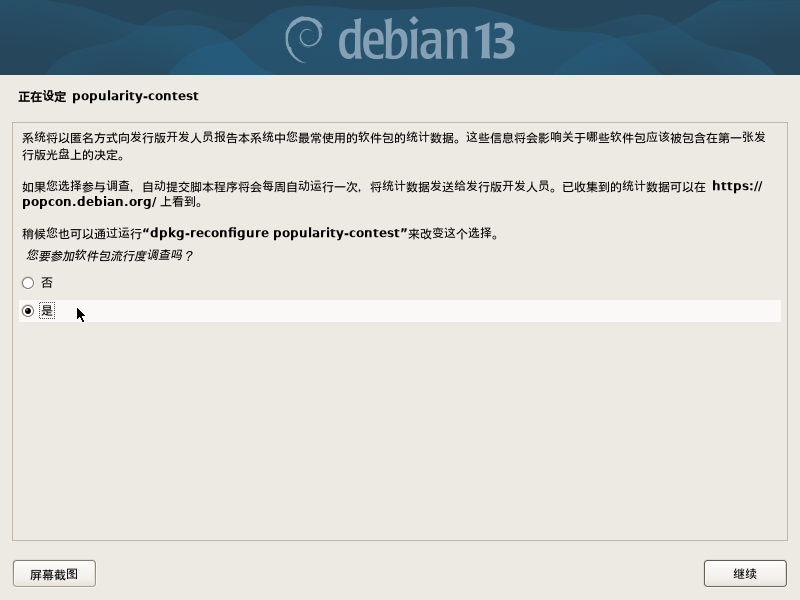

选择好后，点击 `继续`。

### 安装可选软件包

#### 选择要安装的软件

在这一步，我们需要选择安装到新系统的软件。默认有以下三个选项：`Debian 桌面环境`，`GNOME`，和 `标准系统工具`。

想象桌面环境是图形软件的画布，图形软件（比如游览器，视频播放器等...）作为一个个窗口在桌面环境中打开，桌面环境渲染这些窗口并将他们输出到屏幕上。

在本教程中，我们将 Debian 作为*桌面操作系统*，因此需要安装一个*桌面环境*。

选择 `Debian 桌面环境`，`标准系统工具`，再选择`GNOME`, `Xfce`, `GNOME Flashback`, `KDE Plasma`, `Cinnamon`, `MATE`, `LXDE`, `LXQT` 中的至少一个。

??? tip "选择多个桌面环境..."
    当然可以选择几个不同的桌面环境。你可以试一试每个桌面环境，比较它们然后选择一个日用。你也可以在安装完成后卸载不用的桌面环境。

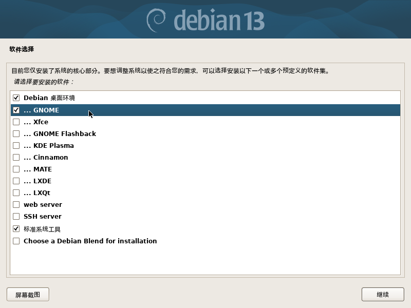

!!! question "不确定选择哪个？"
    如果不确定，就选择默认的三个：`Debian 桌面环境`，`GNOME`，和 `标准系统工具`。

选好以后，点击 `继续`。

#### 安装软件包

点击确认后，安装器会下载并安装所有需要的软件包。此过程可能需要几分钟到一天，具体时间取决于您的网络速度。

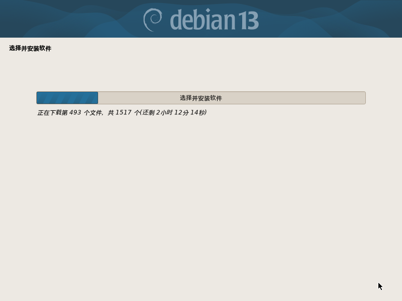

### 完成安装

现在 Debian 已经完成安装了，拔出安装媒介（U盘或移动硬盘）。

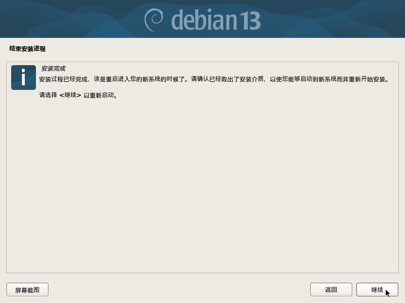

点击 `继续`，以重新启动。重启后，我们会进入新安装的 Debian GNU/Linux 操作系统。

## 启动

开机后，我们会进入 GNU GRUB。

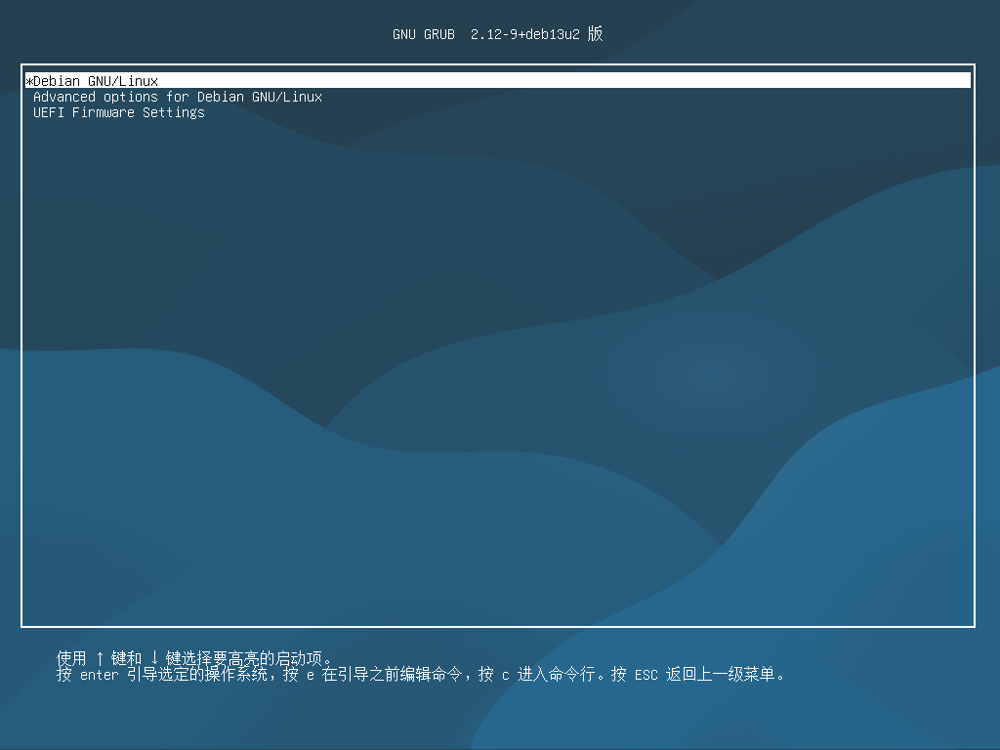

要启动 Debian，用键盘 `↑` 和 `↓` 键选择 `Debian GNU/Linux`，并按回车键 `Enter`。

## 安装后要做的事

### 添加用户至 `sudo` 组

Debian 默认不将用户添加至 `sudo` 组。这种情况下使用 `sudo` 执行命令会出现以下报错：

```
linux@desktop-pc:~$ sudo apt update
[sudo] linux 的密码:
linux 未出现在 sudoers 文件中。
```


我们需要将用户添加到 `sudo` 组。

先打开“终端”。取决于您安装的桌面环境，“终端”的名字可能不同。一个好方法是在搜索栏里搜 `terminal` 。

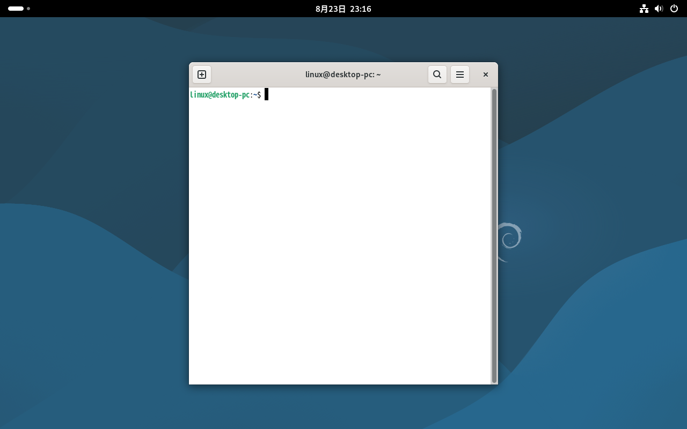

为了下面的操作，我们要暂时切换至 *root 用户*。我们使用 `su` 命令来切换用户。

在终端里输入 `su`，再输入 ***root 用户*的密码**，按回车键 `Enter`。

???+ tip "我的窗口是不是卡住了？"
    没有卡住。为了安全考量，您看不到您正在输入的密码。

```
linux@desktop-pc:~$ su
密码:
root@desktop-pc:/home/linux#
```

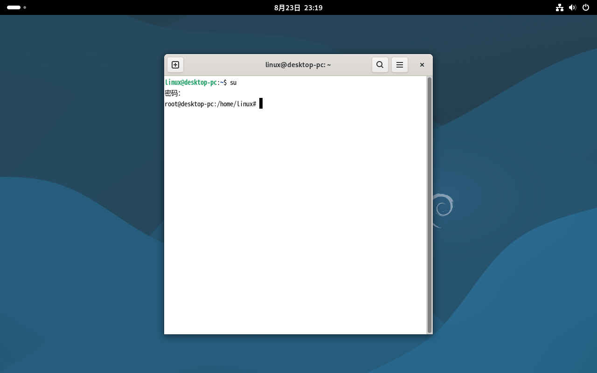

现在我们已经切换到了 *root 用户*。要把用户加进一个组，我们使用 `gpasswd -a` 命令。

在终端里输入 `gpasswd -a`，**一个空格**，您的用户名，**一个空格**，`sudo`，再按回车键 `Enter`。

这里笔者的用户名是 `linux`，所以输入 `gpasswd -a linux sudo`。

```
root@desktop-pc:/home/linux# gpasswd -a linux sudo
正在将用户“linux”加入到“sudo”组中
```

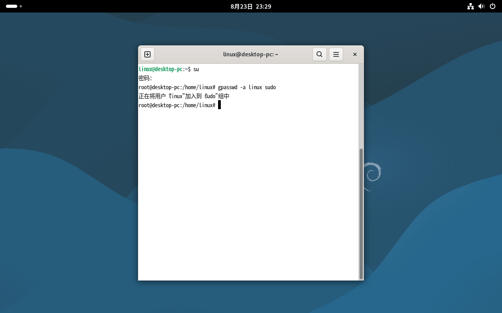

加入完成后，按 `Ctrl` + `D` 来退出 root 用户。注销并重新登录（也可以重启），`sudo` 就可以正常使用了。