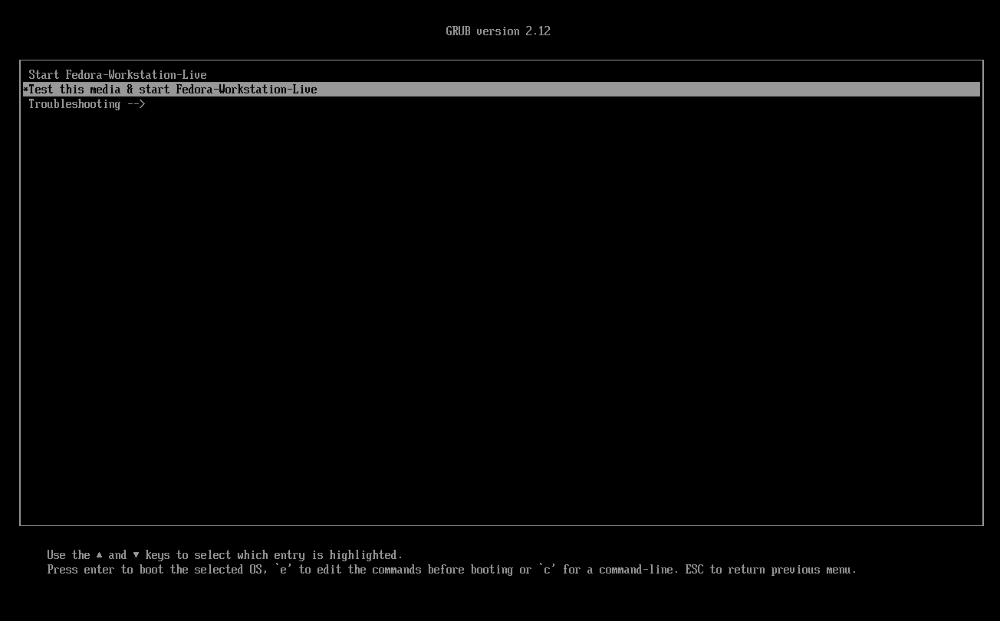
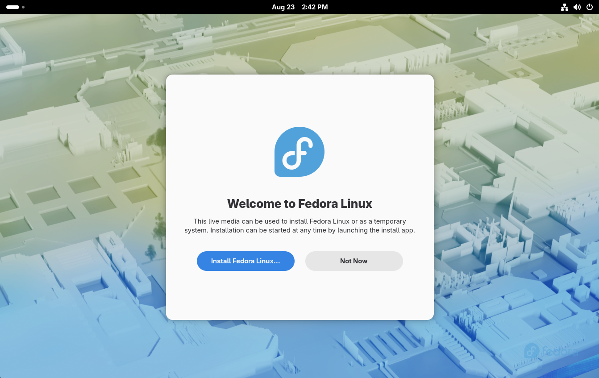
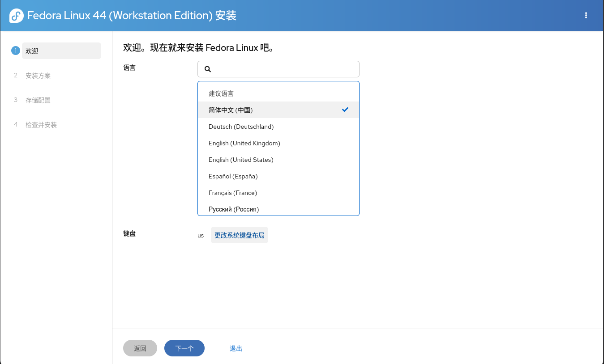
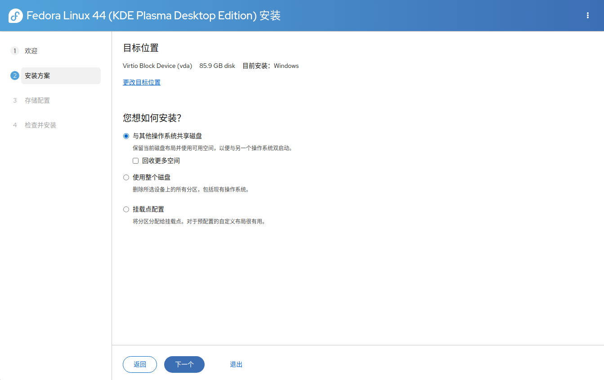
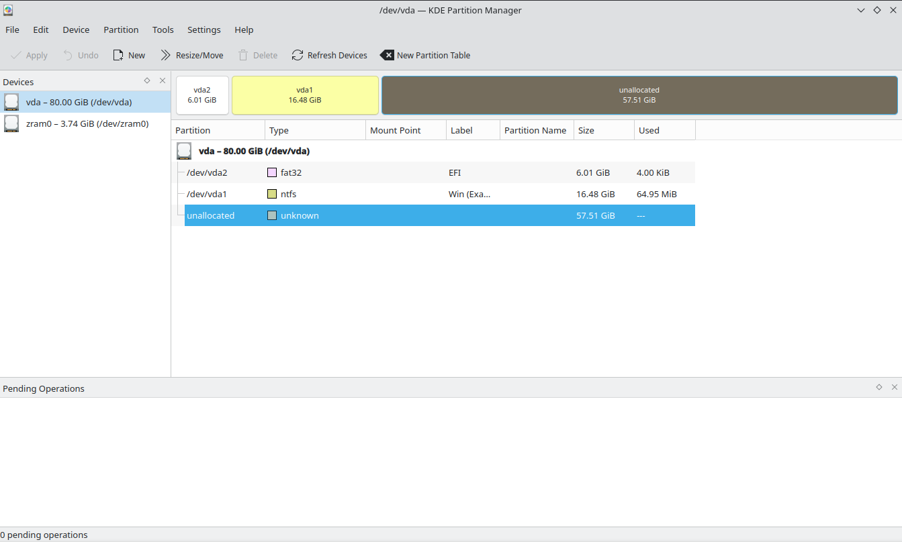
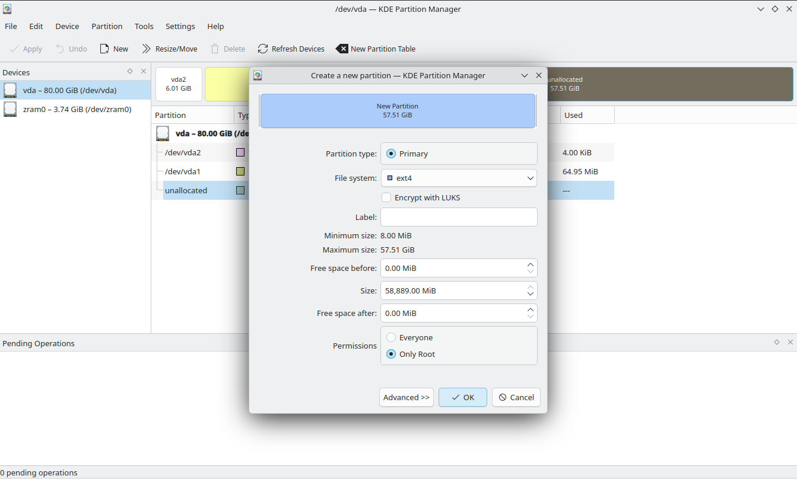
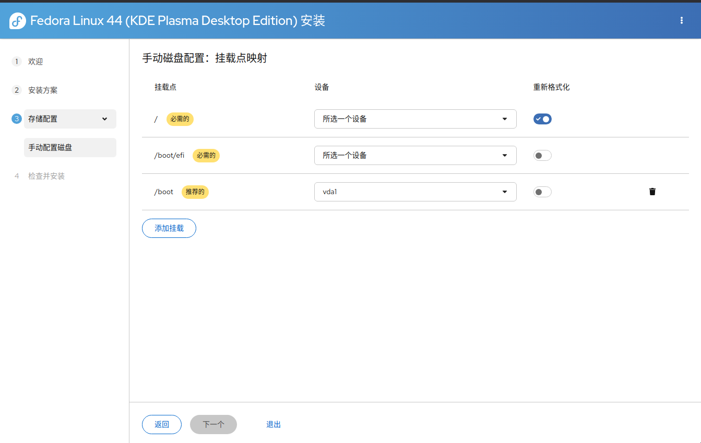

# Fedora

Fedora是一款前沿、开放的发行版，有着广泛的社区支持，并且提供多种变体可供选择。

以下我们以Fedora Workstation/KDE为例示范如何安装Fedora。

## GRUB

在使用U盘启动之后，您会进入GRUB页面。这时，会提供三个选项可选。

- Start Fedora-Workstation-Live: 直接启动LiveISO环境，适合赶时间的用户
- Test this media & start Fedora-Workstation-Live: 验证并启动LiveISO环境，会校验当前的镜像是否出现损坏，推荐
- Troubleshooting -->  
  - Start Fedora-Workstation-Live in basic graphics mode: 用于解决显卡驱动兼容性问题，若前面选项出现黑屏卡死请选这个

## 安装器

开机之后，会出现弹窗，询问是否要安装Fedora，此处请选择“Install Fedora Linux...”。

???+ tip "提示"
    如果您的部分准备工作（如分区）等没有完毕，您可以选择另外一个选项返回桌面，并通过LiveISO的自带应用操作系统。您可以随时按Win键或者将鼠标置于屏幕左上角来打开Dock栏，选择Install to Hard Drive来重新打开安装器。

## 语言与键盘布局

您可以在输入框中输入Chinese来查找并选择简体中文。键盘布局可以默认为US或者改为“Chinese (China)”。

<!--为模拟双系统环境，从此处开始使用Fedora KDE演示
谁叫GNOME的分区软件太垃圾了呢...-->

## 分区设置

在这之后，您会进入分区设置。

如果您想要摒弃其他操作系统，只留下Fedora，请选择“使用整个磁盘”。如果您想要与其他系统共存，请选择“挂载点配置”。

???+ question "为什么不建议选择“与其他系统共享磁盘”？"
    该选项会无视系统上已有的EFI分区，而是另行创建新的EFI分区，尽管该做法可能规避Windows Update的引导覆盖，但这有可能导致兼容性问题。

    此外，该选项默认将根目录挂载的分区初始化为Btrfs文件系统。如果您不知道这是什么，我们极不建议您选择该选项！

### 手动分区

如果您选择了“挂载点配置”，您需要手动创建系统分区。

此时，您可以按下Win键呼出操作系统的菜单，搜索并打开桌面自带的分区管理器（一般包含Partition字样）。

请选中您事先腾出的空白区域，并点击New，在弹出菜单中选择您要初始化的文件系统（建议选择Ext4,请勿选择NTFS！）。点击OK，点击应用上栏中的Apply来应用更改。

如果您的EFI空间不足，或是想要单独分区/boot，请在弹出窗口上方的可视化部分拖动分区两侧来留出空间，为创建/boot分区留出空间。在这之后，重复上述的创建操作来创建/boot分区即可。

各个桌面环境的分区管理器存在差异，如果您不明白怎么操作，我们建议您寻求他人或AI的帮助。

在这之后，返回安装器，为创建好的分区分配挂载点。如果您刚刚没有为`/boot`单独分区，您可以点击右侧的小垃圾桶来删除这个选项。根分区选择刚刚创建的大分区，`/boot/efi`请选择您计算机已有的EFI分区（通常位于列表第一个，大小不大的FAT32分区）。

!!! warning "警告"
    如果您的计算机上已经存在了操作系统，请一定不要勾选`/boot/efi`的“重新格式化”！！！

在这之后，点击下一步。

???+ tip "磁盘加密"
    如果您开启了磁盘加密，您会需要在每次开机时输入密码来解锁分区。

## 大功告成

最后，您可以检查您的分区方案，确认无误后，继续安装即可！
